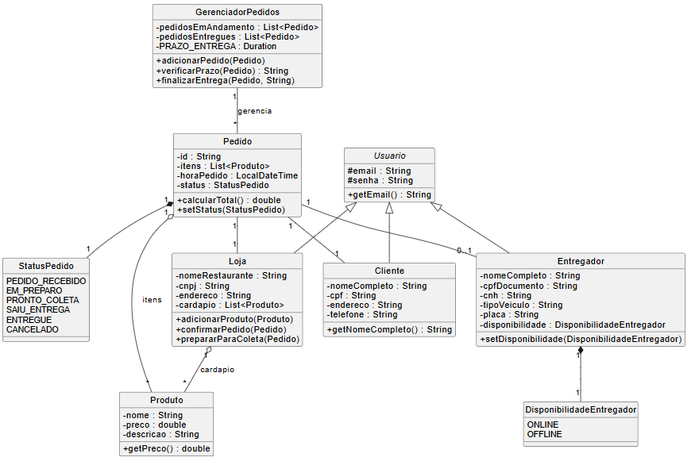

# Sistema de entrega feito por 

1. **Ygor Alves – Líder RA: 825228107**
2. **Alex Lima RA: 825227439**
3. **Luigi Castro Bedin RA: 82526726**
4. **Juliana Nogueira Ramos RA: 825230853**
 
>>Descrição Detalhada do Programa Java
O programa é dividido em quatro módulos principais, com um foco central no controle do ciclo de vida de um Pedido.
1. Módulo de Entidades (Quem faz o quê)
   Este módulo define os participantes do sistema e suas características.
   Classe	Descrição e Funções Chave
   Usuario (Base)	Classe abstrata que define as credenciais básicas (email, senha) para todos os tipos de usuários.
   Cliente	Representa o consumidor. Possui dados como nome, CPF e endereço, que são usados para o cadastro e entrega.
   Entregador	Representa o parceiro de logística. Contém dados do veículo (placa, tipoVeiculo) e possui o status de DisponibilidadeEntregador (ONLINE/OFFLINE).
   Loja	Representa o restaurante/estabelecimento. Possui um Cardápio (List<Produto>) e métodos para gerenciar o pedido (confirmarPedido, prepararParaColeta).
   Produto	Representa um item do cardápio com nome, preço e descrição.
   Pedido	A entidade central. Contém o Cliente, a Loja, a lista de Itens (List<Produto>) e o status atual (StatusPedido). Possui um ID único gerado por UUID.

2. Módulo de Gerenciamento de Pedidos (O Core do Sistema)
   A classe GerenciadorPedidos atua como o centro de controle (o backend). Ela gerencia o fluxo de trabalho dos pedidos e o acompanhamento de prazos.
   Método / Propriedade	Função no Sistema
   pedidosEmAndamento	Lista central onde todos os pedidos ativos são registrados.
   adicionarPedido(Pedido)	Recebe um novo pedido do cliente e o adiciona à lista, iniciando seu ciclo de vida.
   visualizarPedidosEmAndamentoParaLoja(Loja)	Filtra e exibe somente os pedidos que pertencem à Loja que está ativa no momento.
   verificarPrazo(Pedido)	Calcula o tempo decorrido desde o horaPedido e compara com o PRAZO_ENTREGA (45 minutos), retornando "ATRASADO" ou "Dentro do Prazo".
   finalizarEntrega(Pedido, String codigoConfirmacao)	Usado pelo Entregador para validar o código (simulado como "1234"), mudar o status para ENTREGUE, e mover o pedido da lista Em Andamento para o Historico.

3. Passo a Passo: O Ciclo de Vida do Pedido (Fluxo de Negócio)
   O pedido muda de estado através das interações dos usuários e do sistema, seguindo este fluxo rigoroso:
   Etapa	Usuário/Ação	Status do Pedido (StatusPedido)	Descrição
1. Criação	Cliente: Faz o pedido e pagamento.	PEDIDO_RECEBIDO	O pedido é registrado no GerenciadorPedidos.
2. Confirmação	Loja: Visualiza o pedido e clica em Confirmar Preparo.	EM_PREPARO	A Loja aceitou o pedido e está produzindo os itens.
3. Finalização Prod.	Loja: Termina a produção e notifica que está pronto.	PRONTO_COLETA	O pedido está lacrado e aguardando um Entregador.
4. Rota	Entregador: Aceita o pedido (PRONTO_COLETA) e sai para a entrega.	SAIU_ENTREGA	O Entregador está a caminho do Cliente.
5. Conclusão	Entregador: Confirma a entrega com um código.	ENTREGUE	O pedido é removido da lista Em Andamento e arquivado.

4. Módulo de Interface (Main e Console)
   A classe Main é responsável por orquestrar a execução e a interação com o usuário através do terminal (console).
   Entrada/Saída: Usa a classe Scanner e métodos auxiliares (lerString, lerInt, lerDouble) para receber dados do teclado (System.in) e imprime informações na tela (System.out.println).
   Gestão de Sessão: A classe Main utiliza variáveis de instância (clienteLogado, lojaAtiva, entregadorAtivo) para rastrear quem está usando o sistema, simulando uma sessão de login.
   Menu de Opções: O loop principal exibe um menu com números, permitindo que o usuário simule o fluxo de um Cliente (fazer pedido), uma Loja (acompanhar/mudar status) ou um Entregador (simular coleta e entrega).

